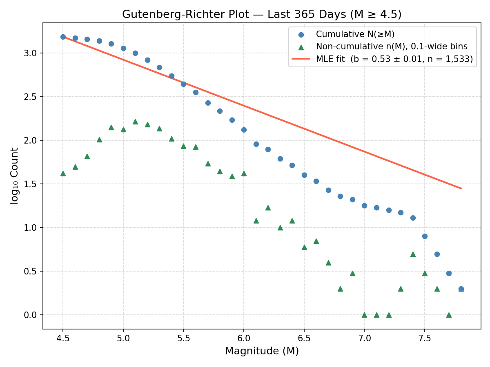
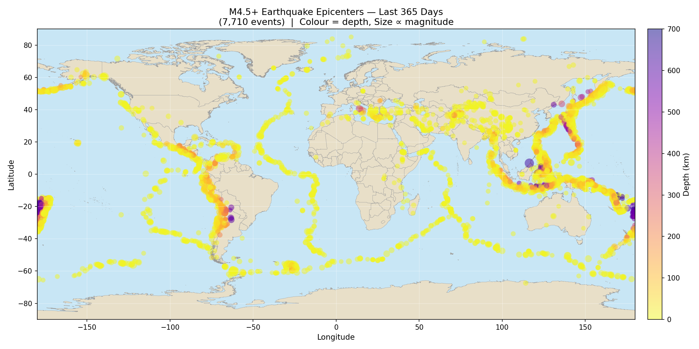
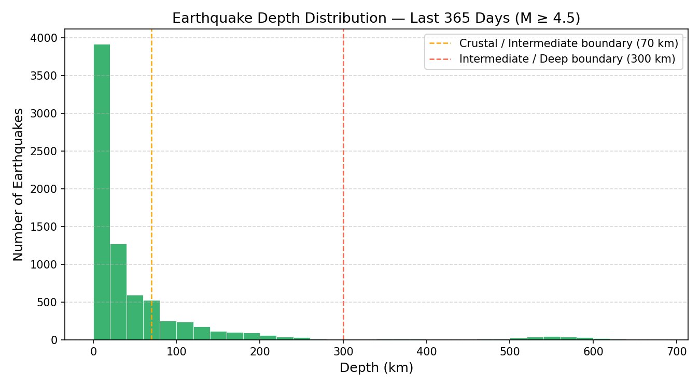
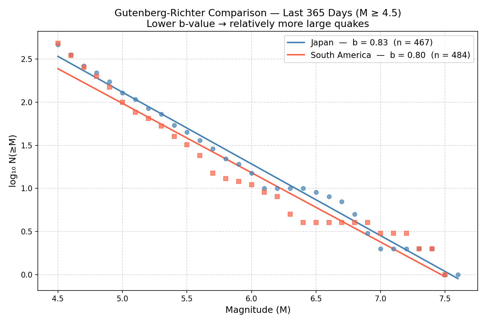
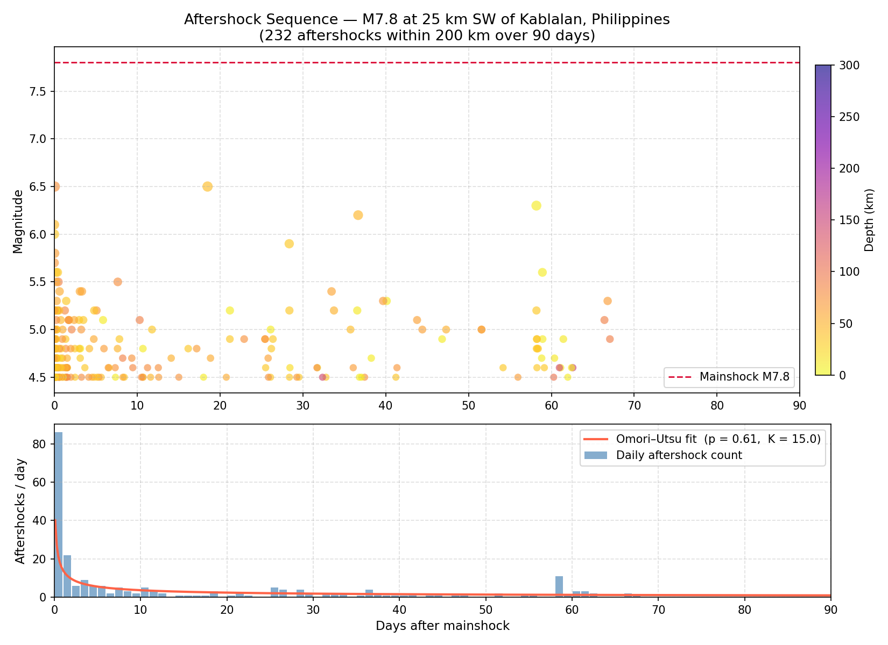
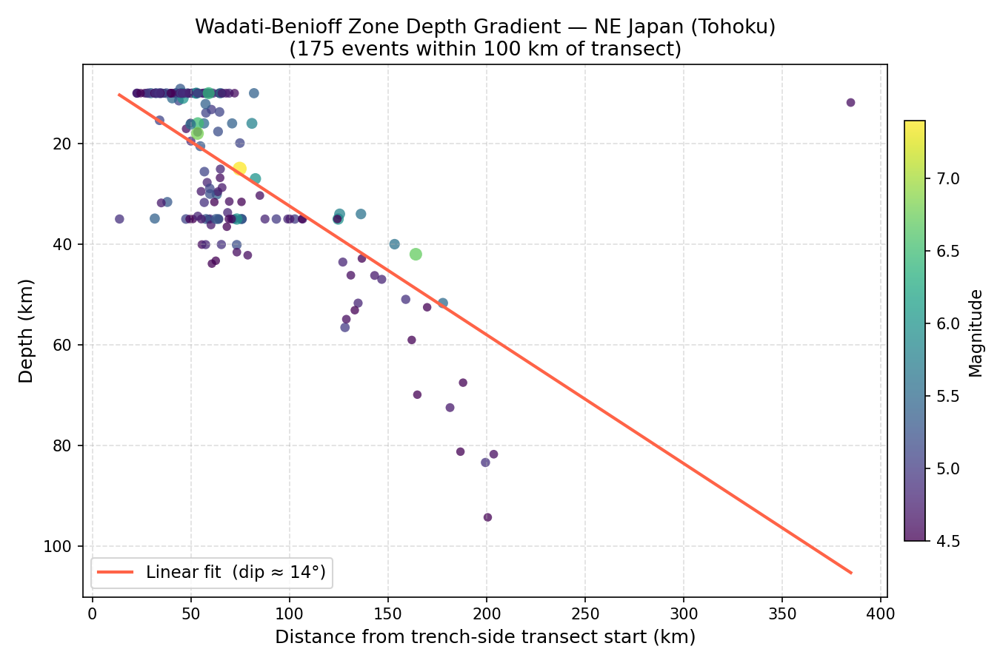

# GroundTruth

**Live map:** https://dzhangg.github.io/GroundTruth/

## Question

**Large earthquakes are rare. How rare, exactly?**

Count every quake above magnitude 4 somewhere, then above 5, then above 6.
The counts fall off fast, and they fall in a strikingly regular way: each
whole step up in magnitude cuts the number of events by roughly a factor of
ten. That regularity is the Gutenberg-Richter law,

$$\log_{10} N(\ge M) = a - bM$$

where $N(\ge M)$ is the count of quakes at or above magnitude $M$. The
intercept $a$ says how seismically busy a region is. The slope $b$ says how
the seismicity is split between small and large events. A $b$ near 1.0 is
typical worldwide; a lower $b$ means the big ones carry more of the total,
which is what locked subduction zones tend to show. This project pulls live
global catalog data and fits that slope directly from observation.

## Data source

The [USGS Earthquake Hazards Program](https://earthquake.usgs.gov/fdsnws/event/1/) FDSN event API (no API key required). By default the script fetches every magnitude 4.5+ earthquake worldwide over the last 365 days as GeoJSON, which `earthquake_explorer.py` parses into a pandas DataFrame.

## Method

Only events from the moment-magnitude family (`MAG_TYPES`, e.g. Mww/Mwc/Mwb/Mwr/Mw) are used for the fit: mixing magnitude scales biases a single b-value, and the FDSN catalog reports several. The b-value is then estimated by the Aki-Utsu maximum-likelihood estimator (`FIT_METHOD = "mle"`, the default), computed directly from event magnitudes at or above the completeness threshold `Mc` (not from binned counts), with the Utsu (1965) correction for 0.1-wide binning:

`b_hat = log10(e) / (mean(M) - (Mc - dM/2))`

Uncertainty is the Shi & Bolt (1982) standard error, `sigma_b = 2.30 * b^2 * sqrt(sum((M_i - mean(M))^2) / (n * (n - 1)))`. The original ordinary-least-squares fit on binned cumulative counts is kept available via `FIT_METHOD = "ols"` for comparison. See `plot_gutenberg_richter()` in [earthquake_explorer.py](earthquake_explorer.py).

## Figure



Cumulative counts `N(≥M)` (blue circles) and non-cumulative per-bin counts `n(M)` (green triangles, not fit) with the fitted GR line (red); the legend reports the fitted b-value, its Shi & Bolt standard error, and the event count `n` used for the fit.

## Other analyses

The same live dataset feeds a few other views. Each is one function in `earthquake_explorer.py` and one output file; examples below are from a live run.

### Epicenter map



Every fetched event plotted on a world map, colored by depth (bright = shallow, dark = deep) and sized by magnitude. Shallow events trace spreading ridges; the darker clusters mark subduction zones. See `plot_world_map()`.

### Depth histogram



Distribution of focal depths, with dashed lines at the 70 km (crustal/intermediate) and 300 km (intermediate/deep) boundaries. Most seismicity is shallow; the small bump past 500 km is deep-focus subduction activity. See `plot_depth_histogram()`.

### b-value comparison



Overlays the GR fit for two regions (Japan vs. South America by default, configured via `COMPARE_REGIONS`) to compare seismicity distributions. See `plot_gr_comparison()`.

### Aftershock sequence



Finds the largest event in the current dataset, collects aftershocks within 200 km / 90 days, and fits an Omori–Utsu decay law `n(t) = K / (c + t)^p` to the daily rate. See `plot_aftershock_series()`.

### Benioff zone depth gradient



Projects events onto a configurable trench-to-backarc transect (`BENIOFF_TRANSECT`, Tohoku/NE Japan by default) and plots depth vs. along-track distance; the linear fit's slope gives the slab's dip angle. See `plot_benioff_zone()`.

### Interactive map

`index.html` renders the exported `earthquakes.geojson` as a Leaflet map, colored by magnitude with a popup per event, live at https://dzhangg.github.io/GroundTruth/. Run it locally instead with `python -m http.server` (see below). The raw `earthquakes.geojson` also renders on its own through GitHub's native GeoJSON viewer: https://github.com/dzhangg/GroundTruth/blob/main/earthquakes.geojson.

## Running it

```bash
python -m venv venv
source venv/bin/activate        # Windows: venv\Scripts\Activate.ps1
pip install requests pandas numpy matplotlib
python earthquake_explorer.py
```

Every run also archives a dated copy of its outputs under `snapshots/` for tracking change over time. Configuration (magnitude cutoff, time window, region filter, comparison regions, transect) lives in the `CONFIG` block at the top of `earthquake_explorer.py`.

To view the interactive map locally instead of the live GitHub Pages deployment:

```bash
python -m http.server
# then open http://localhost:8000
```

## Roadmap

- [ ] Pair catalog events with InSAR coseismic interferograms: for M6.5+ events, pull pre/post-event Sentinel-1 SAR pairs from the [Alaska Satellite Facility](https://asf.alaska.edu/) archive, generate a coseismic interferogram, and compare the deformation fringe pattern's location and inferred fault geometry against the catalog epicenter and depth.
- [ ] Fit ETAS (Epidemic-Type Aftershock Sequence) models to aftershock sequences instead of just plotting them: maximize the point-process log-likelihood over `(mu, K, alpha, c, p)` to get real parameters and testable forecasts (e.g. expected event counts in a future window, scoreable against what the catalog records), rather than the current two-parameter Omori-Utsu curve fit.

## License

Released under the [MIT License](LICENSE).
